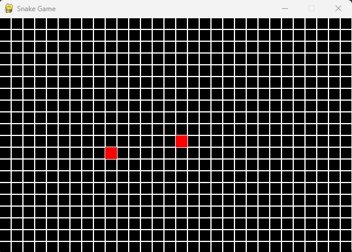

# Snake-Game

A simple Snake game developed in Python to practice and explore the Pygame library.

## Requirements

- Python 3
- Pygame

## Installation

```bash
pip install pygame
```

## Usage

```bash
python SnakeGame.py
```

## Screenshot

